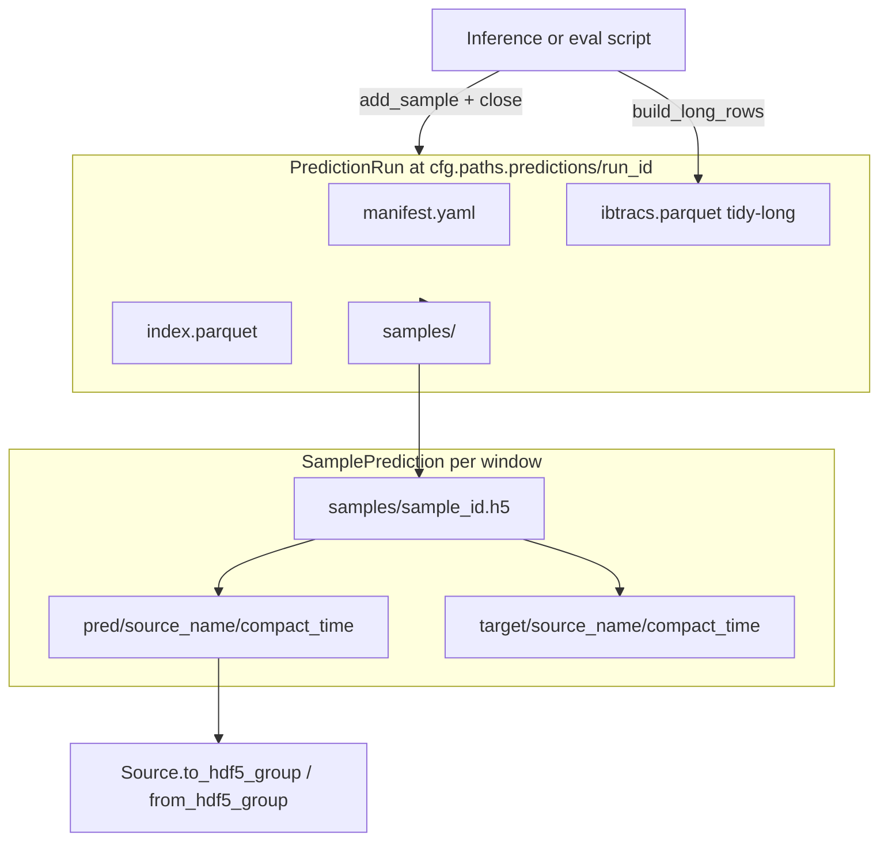

# TC-Fuse predictions interface

Canonical tests: [`tests/data/predictions/`](../../../tests/data/predictions/).

Claude Code: invoke `/predictions` (reads this skill). Do **not** load all Python modules under `src/tcfuse/data/predictions/` unless this skill points to a specific symbol.

**Coding style:** follow [`.cursor/rules/tcfuse-core.mdc`](../../rules/tcfuse-core.mdc) § Human-readable code (priority).

## When to use

- Writing or reading forecast runs under `cfg.paths.predictions/<run_id>/`
- Aggregating IBTrACS scalar metrics (`ibtracs.parquet`)
- Comparing predicted vs target `Source` objects per window
- Building evaluation notebooks or inference export scripts
- Judging whether the interface fits a downstream app (see [adaptation.md](adaptation.md))

**Do not confuse:**

| Module | Role |
|--------|------|
| `tcfuse.data.ibtracs` | Load IBTrACS **CSV** → `Source` for preprocessing |
| `tcfuse.data.predictions.ibtracs` | Tidy-long **pred/target** table for forecast runs |

## Architecture



**Mental model:**

- `SamplePrediction` is the per-window analogue of `StormData`: both index `Source` by `(source_name, time_utc)`. StormData = one HDF5 per **storm**; SamplePrediction = one HDF5 per **forecast window** with `pred/` and `target/` subtrees.
- `PredictionRun` coordinates manifest, streaming `ibtracs.parquet`, `index.parquet`, and many sample HDF5 files.
- **Dual IBTrACS:** scalar track metrics → tidy-long parquet; full field/profile/scalar reconstructions → sample HDF5 under `pred/` / `target/`.

## Quick start

### Write a run

```python
from pathlib import Path

from tcfuse.data.predictions import PredictionRun, SamplePrediction, build_long_rows

run_root = Path(cfg.paths.predictions) / run_id
manifest = {
    "run_id": run_id,
    "model": {"name": "perceiver", "checkpoint": str(ckpt_path)},
    "split": "val",
    "leads_hours": [0, 6, 12],
    "ibtracs_channels": ["usa_vmax_kt", "usa_mslp_hpa"],
}

with PredictionRun.create(run_root, manifest) as run:
    for sample in samples:
        ibtracs_block = build_long_rows(
            sample_id=sample.sample_id,
            storm_id=sample.storm_id,
            season=sample.season,
            basin=sample.basin,
            init_time_utc=sample.init_time_utc,
            leads=leads_for_sample,  # see reference.md
            channels=manifest["ibtracs_channels"],
        )
        run.add_sample(
            sample,
            ibtracs_block,
            window_end_time_utc=window_end,  # optional
        )
```

Pass `ibtracs_long_rows=None` or an empty frame when the window has no IBTrACS rows.

### Read a run

```python
run = PredictionRun.from_disk(run_root)
catalog = run.index
track_table = run.ibtracs  # loads full parquet on first access

sample = run.load_sample(sample_id)
for s in run.iter_samples():  # index order; loads all HDF5 tensors
    ...
```

### Metadata without tensors

```python
meta = SamplePrediction.read_meta(run_root, sample_id)
```

### Public API (`tcfuse.data.predictions`)

`PredictionRun`, `SamplePrediction`, `build_long_rows`, `empty_long_frame`, `ibtracs_long_schema`, `long_to_pivot`, `IBTRACS_LONG_COLUMNS`

## Conventions

- `sample_id` = `f"{storm_id}_{init_time:%Y%m%dT%H%M%SZ}"` (matches `build_splits.py` `init_time_utc`).
- `run_root` = `{cfg.paths.predictions}/{run_id}` — never hardcode filesystem paths.
- Source dict keys: `(source_name, time_utc)` with repository ISO timestamp strings.
- IBTrACS `mask`: `True` only when **both** `pred` and `target` are finite (same as `Source.mask` for paired values).
- Writer is **single-pass**: `add_sample` per window, then `close` (or `with PredictionRun.create(...) as run`).
- Reopened runs are read-only; `add_sample` raises if `_closed`.
- `manifest` is a free-form dict (YAML). At `close()`, the writer sets `created_at_utc` (if missing), `n_samples`, and `predicted_sources`.
- `pred_sources` and `target_sources` keys need not match; partial coverage is allowed.

## Progressive disclosure

- Schemas, HDF5 tree, index columns, `build_long_rows` contract → [reference.md](reference.md)
- Fit assessment and API change proposals → [adaptation.md](adaptation.md)

## Maintenance

When changing any file under `src/tcfuse/data/predictions/`, update this skill in the **same PR** (at minimum `reference.md` for schema/path changes). If triggers or agent rules change, update `.claude/commands/predictions.md` and `CLAUDE.md`.
